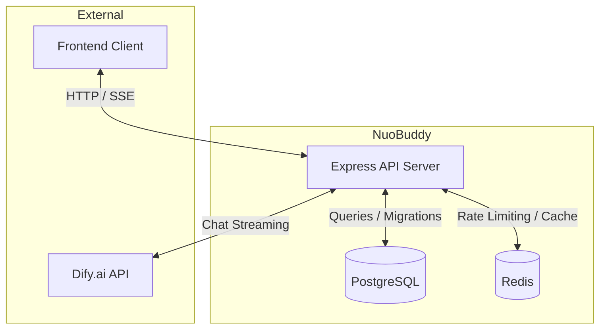
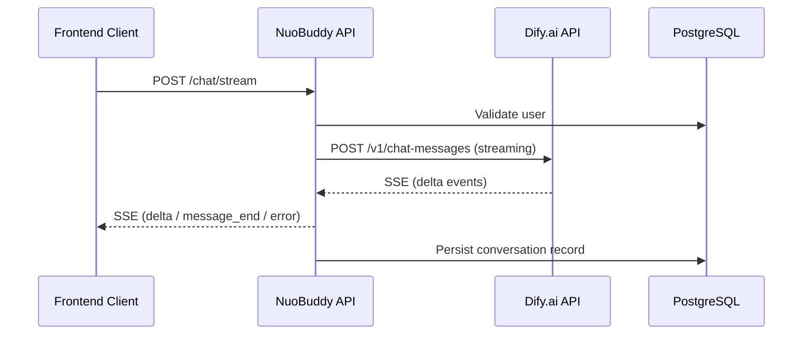

# NuoBuddy Backend

AI Agent Chatbot backend powered by [Dify.ai](https://dify.ai). Provides user authentication, conversation management, and real-time AI streaming chat via Server-Sent Events (SSE).

> Full API reference: [https://bu3l68g0i1.apifox.cn](https://bu3l68g0i1.apifox.cn)

## Features

- **Streaming AI Chat** — Proxies Dify.ai SSE responses directly to the client with minimal latency
- **JWT Authentication** — Stateless token-based auth with configurable expiry
- **Role-Based Access Control** — `user` and `admin` roles enforced via middleware
- **User Management** — Registration, login, profile updates, email-based password reset
- **Admin Panel API** — Paginated user listing, user creation and deletion, password reset
- **System Settings** — Runtime-configurable key/value settings stored in PostgreSQL
- **Redis Caching** — Rate limiting for email verification codes
- **Containerised** — Docker Compose brings up the full stack (app + PostgreSQL + Redis) with one command

## Tech Stack

| Layer | Technology |
|---|---|
| Runtime | Node.js >= 18 |
| Language | TypeScript 5 (strict mode) |
| Framework | Express.js 4 |
| ORM | TypeORM 0.3 |
| Database | PostgreSQL 16+ |
| Cache | Redis 7+ (ioredis) |
| AI Backend | Dify.ai (SSE streaming) |
| Build Tool | tsup (SWC) |
| Package Manager | pnpm |

## Architecture



### Chat Streaming Flow



## Prerequisites

- Node.js `>= 18.0.0`
- pnpm `>= 8`
- PostgreSQL 16+
- Redis 7+
- A Dify.ai account with an API key

## Installation

```bash
git clone <repo-url>
cd nuobuddy-backend
pnpm install
```

## Configuration

Copy the environment template and fill in the required values:

```bash
cp .env.example .env
```

### Environment Variables

| Variable | Description | Default |
|---|---|---|
| `PORT` | Server port | `3000` |
| `NODE_ENV` | Environment (`development` / `production`) | `development` |
| `DB_HOST` | PostgreSQL host | `localhost` |
| `DB_PORT` | PostgreSQL port | `5432` |
| `DB_USERNAME` | Database username | `nuobuddy` |
| `DB_PASSWORD` | Database password | — |
| `DB_DATABASE` | Database name | `nuobuddy` |
| `DB_SYNCHRONIZE` | Auto-sync schema on startup (dev only) | `false` |
| `DB_LOGGING` | Enable TypeORM SQL logging | `false` |
| `DB_SSL` | Enable SSL for the DB connection | `false` |
| `JWT_SECRET` | JWT signing secret (required) | — |
| `JWT_EXPIRES_IN` | Token expiry duration | `7d` |

> **Important:** Never set `DB_SYNCHRONIZE=true` in production. Use migrations instead.

## Usage

### Development (hot reload)

```bash
pnpm dev
```

Server starts on `http://localhost:3000`.

### Production

```bash
pnpm build    # Compile TypeScript → dist/
pnpm start    # node dist/main.js
```

### Docker Compose (full stack)

```bash
# Start PostgreSQL + Redis (development)
docker-compose -f docker-compose.dev.yml up -d

# Start the full production stack (app + DB + cache)
docker-compose up -d
```

## API Reference

All endpoints return a unified JSON response:

```json
{
  "status": 200,
  "data": { ... },
  "message": "Success"
}
```

Authentication is JWT-based. Protected routes require:

```
Authorization: Bearer <token>
```

Full interactive documentation is available at [https://bu3l68g0i1.apifox.cn](https://bu3l68g0i1.apifox.cn).

---

### Health

| Method | Path | Auth | Description |
|---|---|---|---|
| GET | `/health` | None | Server health, uptime, and memory stats |

---

### User / Auth — `/user`

| Method | Path | Auth | Description |
|---|---|---|---|
| POST | `/user/register` | None | Register a new account |
| POST | `/user/login` | None | Login and receive a JWT |
| GET | `/user/profile` | JWT | Get the authenticated user's profile |
| POST | `/user/profile/update` | JWT | Update username or password |
| POST | `/user/send-code` | None | Send an email verification code |
| POST | `/user/forgot-password` | None | Reset password using a verification code |

#### POST `/user/register`

```json
// Request body
{ "username": "alice", "email": "alice@example.com", "password": "secret123" }

// Response 200
{
  "status": 200,
  "data": {
    "token": "<jwt>",
    "user": { "id": "uuid", "username": "alice", "email": "alice@example.com", "role": "user" }
  },
  "message": "Registration successful"
}
```

#### POST `/user/login`

```json
// Request body
{ "email": "alice@example.com", "password": "secret123" }
```

#### POST `/user/send-code`

```json
// Request body — type: "register" | "forgot-password"
{ "email": "alice@example.com", "type": "forgot-password" }
```

#### POST `/user/forgot-password`

```json
// Request body
{ "email": "alice@example.com", "code": "123456", "newPassword": "newSecret123" }
```

---

### Chat — `/chat`

| Method | Path | Auth | Description |
|---|---|---|---|
| POST | `/chat/stream` | JWT | Send a message; response streams via SSE |

#### SSE Event Types

| Event | Payload | Description |
|---|---|---|
| `delta` | `{ content: string }` | Partial AI response chunk |
| `message_end` | `{ conversationId: string }` | Stream complete |
| `error` | `{ message: string }` | Error during streaming |
| `ping` | — | Heartbeat (can be ignored) |

---

### Admin — `/admin` *(JWT + admin role required)*

| Method | Path | Description |
|---|---|---|
| GET | `/admin/users` | List users (paginated) — query params: `page`, `limit` |
| POST | `/admin/users` | Create a user — body: `{ username, email, password, role? }` |
| DELETE | `/admin/users/:id` | Delete a user by ID |
| PATCH | `/admin/users/:id/password` | Reset a user's password — body: `{ newPassword }` |

---

### Settings — `/settings` and `/api`

| Method | Path | Auth | Description |
|---|---|---|---|
| GET | `/settings` | None | Get all system settings |
| PUT | `/settings` | None | Update system settings |
| GET | `/api` | None | Alias — get all system settings |
| PUT | `/api` | None | Alias — update system settings |

---

## Project Structure

```
src/
├── config/
│   ├── database.ts      # TypeORM DataSource setup
│   ├── env.ts           # Validated environment variable loader
│   └── redis.ts         # ioredis client
├── entities/
│   ├── User.ts          # User entity (id, username, email, role, isActive, …)
│   ├── Conversation.ts  # Conversation / message entity
│   └── SystemSetting.ts # Key-value system settings entity
├── middleware/
│   ├── auth.ts          # JWT guard — attaches req.user
│   ├── admin.ts         # Admin role guard
│   └── asyncHandler.ts  # Wraps async route handlers for error forwarding
├── routes/
│   ├── index.ts         # Route aggregation
│   ├── health.ts
│   ├── user.ts
│   ├── chat.ts
│   ├── admin.ts
│   └── settings.ts
├── services/
│   ├── AuthService.ts   # JWT sign / verify
│   ├── UserService.ts   # User CRUD, password hashing
│   ├── DifyService.ts   # Dify.ai SSE streaming integration
│   ├── EmailService.ts  # Verification code send / verify (Redis-backed)
│   └── SettingService.ts
├── lib/
│   ├── response.ts      # Unified sendSuccess / sendError helpers
│   └── settingsService.ts
├── types/
│   ├── dify.ts          # Dify API type definitions
│   └── express.d.ts     # Augments Express Request with req.user
├── migrations/
│   └── InitialSchema.ts # Initial database migration
└── main.ts              # App bootstrap and server listen
```

## Development Guide

### Code Quality

```bash
pnpm lint          # ESLint check (Airbnb + TypeScript rules)
pnpm lint:fix      # Auto-fix lint issues
pnpm type-check    # TypeScript type check (no emit)
```

### Git Hooks

Husky runs **commitlint** on commit messages. Follow [Conventional Commits](https://www.conventionalcommits.org/):

```
feat: add conversation soft-delete
fix: handle Dify timeout gracefully
chore: update dependencies
```

### Database Migrations

TypeORM migrations are located in `src/migrations/`. For production deployments:

1. Set `DB_SYNCHRONIZE=false`
2. Run migrations explicitly via TypeORM CLI

### CI/CD

| Workflow | Trigger | Jobs |
|---|---|---|
| CI ([ci.yml](.github/workflows/ci.yml)) | Push / PR to `main`, `develop` | Lint → Type Check → Build |
| CD ([cd.yml](.github/workflows/cd.yml)) | Push to `main`, manual dispatch | Docker build → push to `ghcr.io` |

The production Docker image uses a multi-stage build (builder + slim runner on Node 20 alpine).

## Deployment

### Production Checklist

- [ ] Set `NODE_ENV=production`
- [ ] Set a strong random `JWT_SECRET`
- [ ] Set `DB_SYNCHRONIZE=false` and run migrations
- [ ] Enable `DB_SSL=true` for cloud-hosted databases
- [ ] Configure a reverse proxy (nginx / Caddy) for TLS termination
- [ ] Set up log aggregation and health monitoring

### Running with Docker Compose

```bash
docker-compose up -d
```

This starts the application on port 3000, PostgreSQL on port 5432, and Redis on port 6379 with persistent named volumes.

## Contributing

1. Fork the repository and create a feature branch from `develop`
2. Follow the Conventional Commits specification
3. Ensure `pnpm lint`, `pnpm type-check`, and `pnpm build` all pass
4. Open a pull request targeting `develop`

## FAQ

**Q: The server starts but immediately exits.**
A: It cannot connect to PostgreSQL. Verify `DB_*` environment variables and that PostgreSQL is running.

**Q: Chat streaming returns no events.**
A: Check that `DIFY_API_KEY` and `DIFY_API_URL` are set correctly in `.env` and that the Dify application is published.

**Q: How do I create the first admin user?**
A: Register a normal user via `POST /user/register`, then manually update the `role` column to `admin` in the database. Subsequent admins can be created via `POST /admin/users`.

## License

See [LICENSE](./LICENSE).
