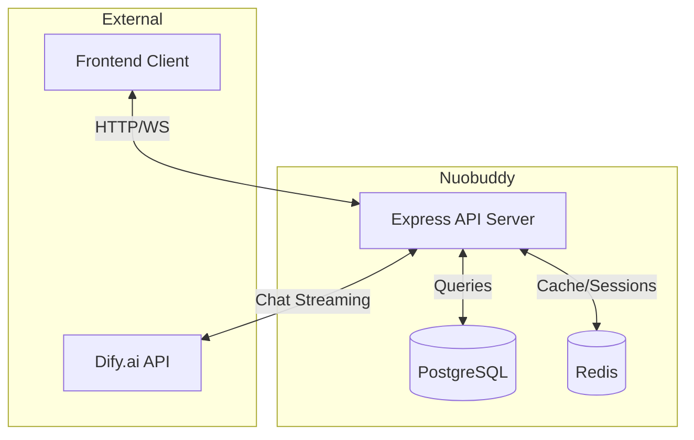
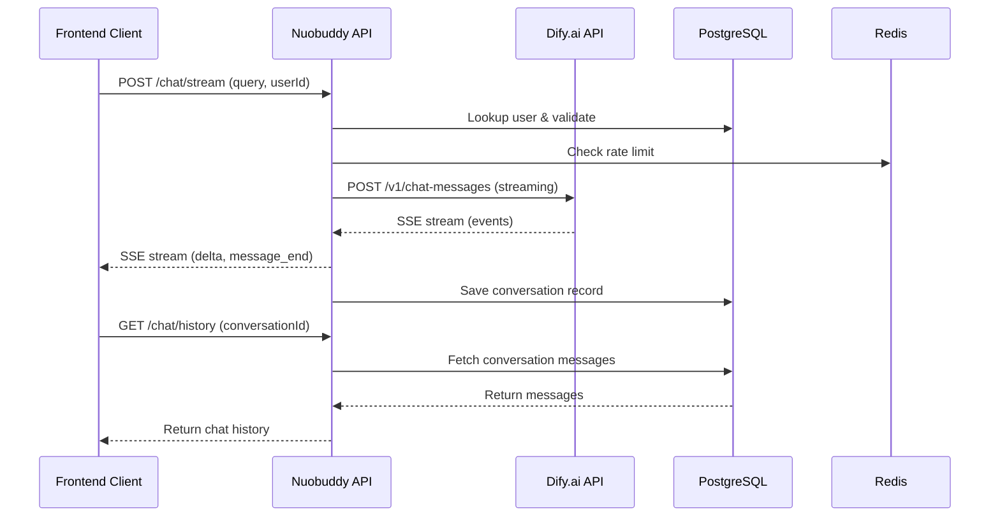

# Nuobuddy Backend

AI Agent Chatbot Backend powered by Dify.ai. This service provides user authentication, conversation management, and integrates with Dify's streaming chat API to deliver AI-powered chatbot capabilities.

## Tech Stack

- **Runtime**: Node.js >= 18
- **Language**: TypeScript (strict mode)
- **Framework**: Express.js
- **ORM**: TypeORM
- **Database**: PostgreSQL
- **Cache**: Redis (via ioredis)
- **Build Tool**: tsup
- **Package Manager**: pnpm
- **AI Backend**: Dify.ai

## Architecture

### System Architecture



### Dify Interaction Flow



## Prerequisites

- Node.js >= 18
- pnpm >= 8
- PostgreSQL 16+
- Redis 7+
- Dify.ai account and API credentials

## Configuration

Copy the example environment file and configure:

```bash
cp .env.example .env
```

### Environment Variables

| Variable | Description | Default |
|----------|-------------|---------|
| `PORT` | Server port | `3000` |
| `NODE_ENV` | Environment | `development` |
| `DB_HOST` | PostgreSQL host | `localhost` |
| `DB_PORT` | PostgreSQL port | `5432` |
| `DB_USERNAME` | Database username | `nuobuddy` |
| `DB_PASSWORD` | Database password | - |
| `DB_DATABASE` | Database name | `nuobuddy` |
| `DB_SYNCHRONIZE` | Auto-sync schema | `false` |
| `DB_LOGGING` | Enable SQL logging | `false` |
| `DB_SSL` | Enable SSL connection | `false` |
| `JWT_SECRET` | JWT signing secret | - |
| `JWT_EXPIRES_IN` | Token expiry | `7d` |

## Installation
We use pnpm for package management. Install dependencies with:
```bash
pnpm install
```

If you don't have pnpm installed, you can install it globally with npm firstly:
```bash
npm install -g pnpm
```

## Development

Start the development server with hot reload:

```bash
pnpm dev
```

## Build

Compile TypeScript for production:

```bash
pnpm build
```

## Production

Run the compiled production build:

```bash
pnpm start
```

## Project Structure

```
nuobuddy-backend/
├── src/
│   ├── config/          # Configuration loaders
│   │   ├── database.ts  # TypeORM DataSource setup
│   │   ├── env.ts       # Environment variables
│   │   └── redis.ts    # Redis client
│   ├── entities/        # TypeORM entity definitions
│   │   ├── Conversation.ts
│   │   ├── SystemSetting.ts
│   │   └── User.ts
│   ├── lib/             # Shared utilities
│   │   └── response.ts  # Unified API response helpers
│   ├── middleware/       # Express middleware
│   │   ├── admin.ts     # Admin role guard
│   │   ├── asyncHandler.ts
│   │   └── auth.ts      # JWT authentication
│   ├── migrations/      # Database migrations
│   │   └── InitialSchema.ts
│   ├── routes/          # Express route definitions
│   │   ├── admin.ts
│   │   ├── chat.ts
│   │   ├── common.ts
│   │   ├── health.ts
│   │   ├── index.ts
│   │   └── user.ts
│   ├── services/        # Business logic & external integrations
│   │   ├── AuthService.ts
│   │   ├── DifyService.ts
│   │   ├── EmailService.ts
│   │   └── UserService.ts
│   ├── types/           # TypeScript declarations
│   │   ├── dify.ts
│   │   └── express.d.ts
│   └── main.ts          # Application entry point
├── sql/                  # SQL scripts
├── .env.example         # Environment template
├── docker-compose.yml   # PostgreSQL & Redis containers
├── package.json
├── tsconfig.json
└── tsup.config.ts
```

## Development Guide

### Code Style

This project uses ESLint with strict rules. Check before committing:

```bash
pnpm lint        # Check for issues
pnpm lint:fix    # Auto-fix issues
```

### Type Checking

Run TypeScript type check without emitting files:

```bash
pnpm type-check
```

### API Response Format

All API responses use a unified `ApiResponse` structure:

```ts
{
  status: number | string,
  data?: T,
  message?: string
}
```

Use helper functions from `@/lib/response`:
- `sendSuccess(res, data, message)` - 2xx response
- `sendError(res, message)` - 4xx error
- `sendNotFound(res, message)` - 404
- `sendUnauthorized(res, message)` - 401
- `sendForbidden(res, message)` - 403
- `sendServerError(res, message)` - 500

### Authentication

JWT-based authentication. Include the token in Authorization header:

```
Authorization: Bearer <token>
```

### Chat Streaming

The chat endpoint supports Server-Sent Events (SSE) for streaming responses:

```
POST /chat/stream
```

Events:
- `delta` - Partial response content
- `message_end` - Stream completed
- `error` - Error occurred
- `ping` - Heartbeat (ignored)

## Deployment

### Using Docker Compose

Start PostgreSQL and Redis:

```bash
docker-compose up -d
```

### Production Checklist

1. Set `NODE_ENV=production`
2. Configure `JWT_SECRET` with a strong random value
3. Enable `DB_SSL=true` for cloud databases
4. Set `DB_SYNCHRONIZE=false` and use migrations
5. Configure a reverse proxy (nginx) for SSL termination
6. Set up monitoring and logging

### Database Migrations

Run migrations manually after schema changes:

```bash
# Migrations are handled by TypeORM on startup
# For production, use migrations instead of synchronize
```

## License

See [LICENSE](./LICENSE) file.
